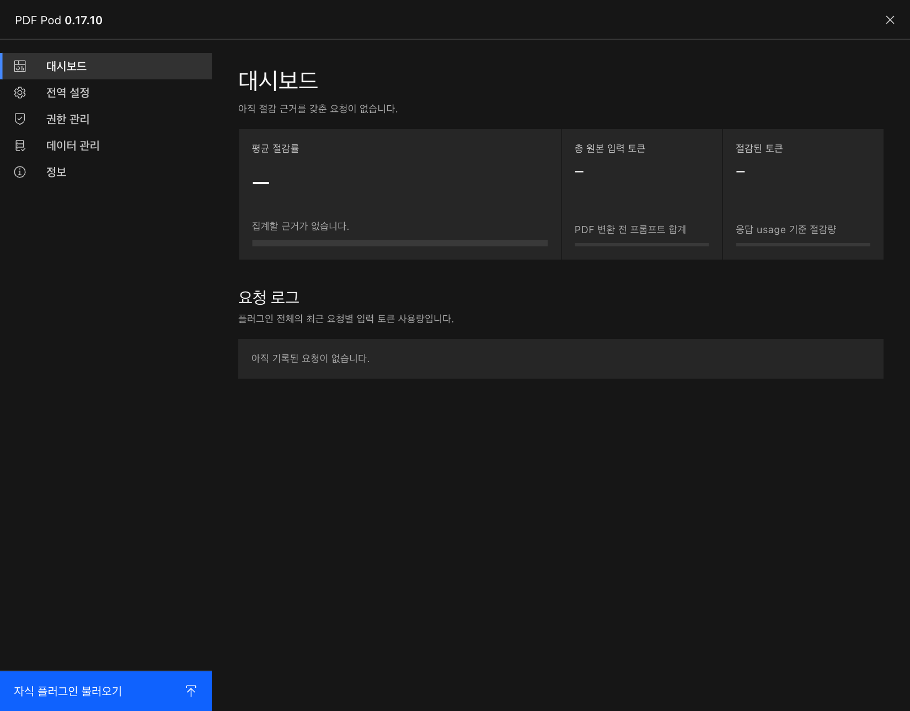
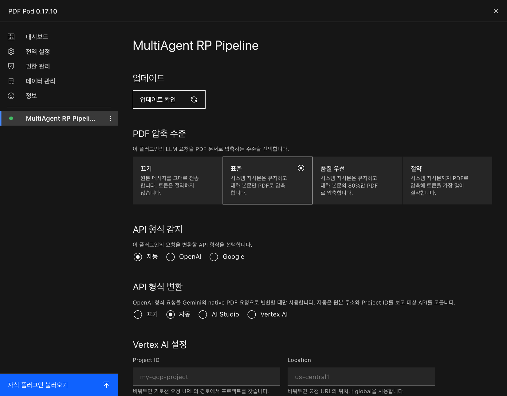
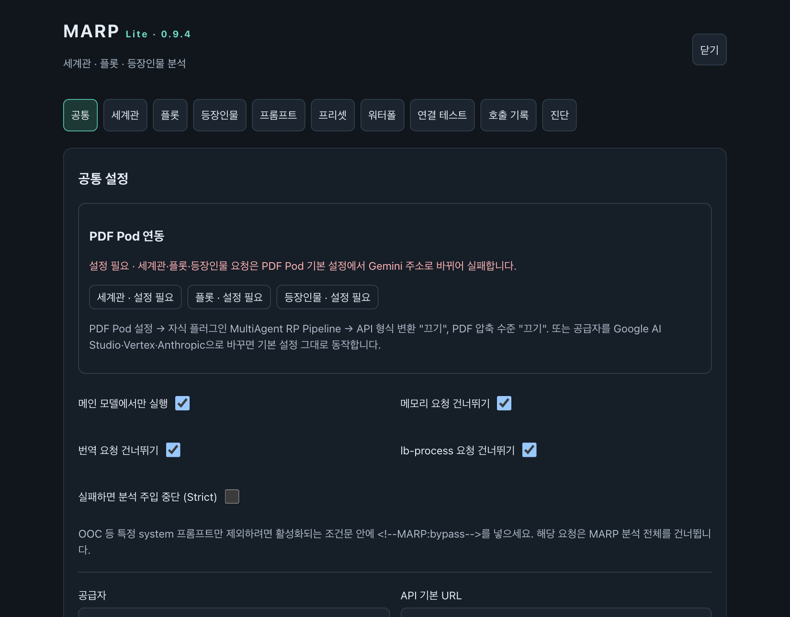
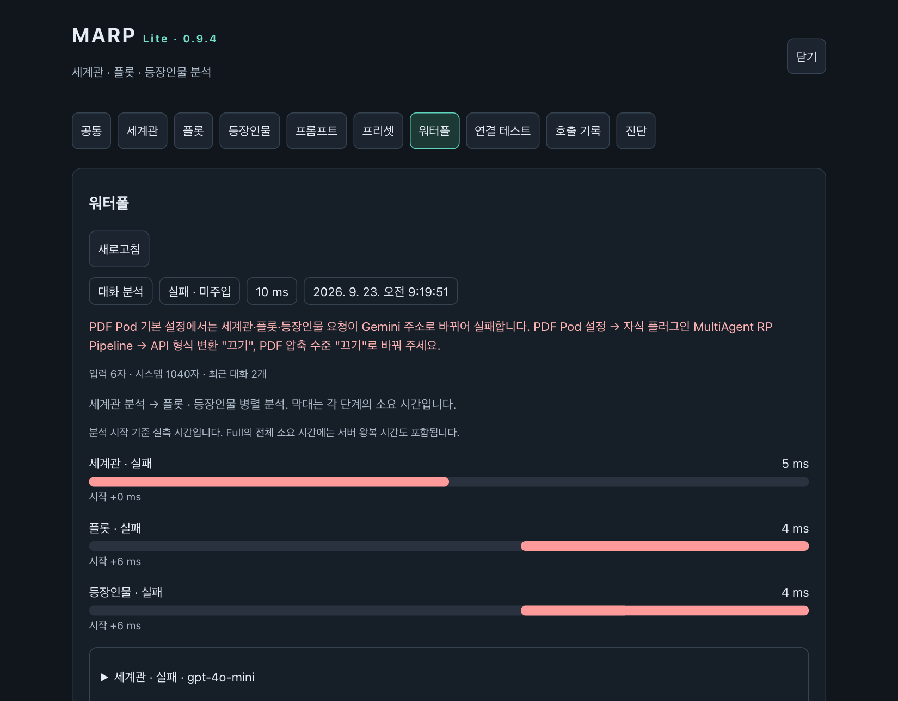
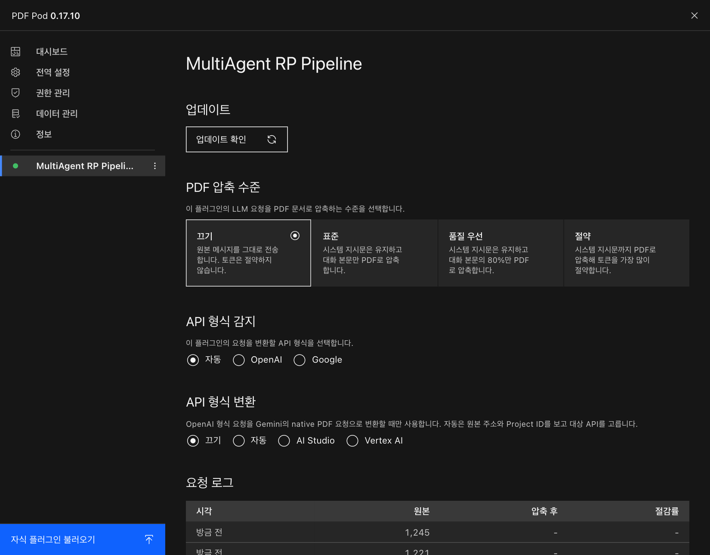
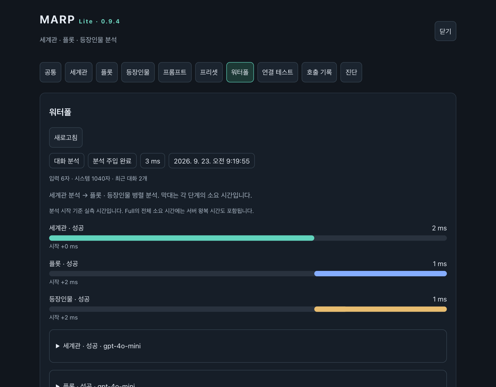

# PDF Pod 안에서 MARP Lite 쓰기

[처음으로](../README.md) · [내장 PDF와 PDF Pod 병용](PDF.md) · [진단 화면 사용법](DIAGNOSTICS.md)

[PDF Pod](https://pkg.panpka.xyz/pdf-pod/latest)는 다른 플러그인을 안에 넣어 실행하면서 LLM 요청을 PDF로 압축해 토큰을 아껴 주는 플러그인입니다. 이 문서는 **MARP Lite를 PDF Pod 안에 넣어 쓰는 방법**을 화면 순서대로 설명합니다.

> 기준 버전: PDF Pod **0.17.10**, MARP **v0.9.4 이상**. MARP Full의 서버 요청은 PDF Pod를 거치지 않으므로 이 문서와 상관없습니다.

## 먼저 알아 둘 점

PDF Pod의 기본 설정(**API 형식 변환: 자동**)은 안에 넣은 플러그인이 보내는 OpenAI 형식 요청을 **모두 Gemini 주소로 바꿔** 보냅니다.

| MARP 분석 에이전트로 쓰는 것 | PDF Pod 기본 설정 그대로 두면 |
| --- | --- |
| Google AI Studio (Gemini) | ✅ 동작 (Gemini로 변환되어 PDF 압축) |
| Vertex AI | ✅ 동작 (Gemini로 변환되어 PDF 압축) |
| Anthropic (Claude) | ✅ 동작 (변환 없이 그대로 전송) |
| OpenAI · OpenRouter · Vercel · 로컬 모델 등 | ❌ **실패**: API 키가 Google로 전달됩니다 |

마지막 줄에 해당하면 아래 **3단계**에서 PDF Pod 설정 두 가지를 바꿔야 합니다. 어느 줄인지 헷갈리면 MARP 화면이 대신 알려 줍니다(2단계).

## 1단계 · MARP를 PDF Pod에 넣기

1. RisuAI 플러그인 설정에서 **PDF Pod**를 엽니다.
2. 왼쪽 아래 **자식 플러그인 불러오기**를 누르고 MARP Lite 파일(`multiagent-lite-vX.Y.Z.js`)을 고릅니다.

3. 왼쪽 목록에 **MultiAgent RP Pipeline**이 생기면 MARP가 PDF Pod 안에서 실행 중입니다. 눌러 보면 이 플러그인에만 적용되는 PDF Pod 설정이 나옵니다. 처음에는 **PDF 압축 수준: 표준**, **API 형식 변환: 자동**으로 되어 있습니다.

## 2단계 · MARP 설정하고 연동 상태 확인하기

1. 채팅 입력창 왼쪽 메뉴(또는 플러그인 설정)에서 **MARP Lite**를 엽니다.
2. **공통** 탭에서 공급자·API URL·키·모델을 입력하고 **설정 저장**을 누릅니다.
   - PDF Pod는 안에 넣은 플러그인마다 저장 공간을 따로 씁니다. MARP를 단독으로 쓰던 분도 **여기서 한 번 다시 입력**해야 합니다.
3. **공통** 탭 맨 위의 **PDF Pod 연동** 카드를 봅니다.
   - **호환**: 그대로 쓰시면 됩니다. 3단계는 건너뛰세요.
   - **설정 필요**: 카드에 적힌 대로 3단계를 진행하세요.

설정을 바꾸기 전에 채팅을 보내면 **워터폴** 탭에 세 분석이 모두 **실패**로 나오고, 빨간 글씨로 같은 조치가 적힙니다. 채팅 답변 자체는 정상으로 나오므로 이 화면에서 확인해야 알 수 있습니다.

## 3단계 · PDF Pod 설정 바꾸기 (설정 필요일 때만)

PDF Pod를 다시 열고 왼쪽 목록에서 **MultiAgent RP Pipeline**을 누른 뒤 두 가지를 바꿉니다. 바꾸는 즉시 적용되고 따로 저장할 필요는 없습니다.

| 항목 | 기본값 | 바꿀 값 | 이유 |
| --- | --- | --- | --- |
| **API 형식 변환** | 자동 | **끄기** | 요청을 Gemini 주소로 바꾸지 않고 원래 주소로 보냅니다. |
| **PDF 압축 수준** | 표준 | **끄기** | PDF 파일을 받지 못하는 모델도 많아서, 원래 텍스트 그대로 보냅니다. |

**API 형식 감지**는 **자동** 그대로 둡니다.

## 4단계 · 잘 되는지 확인하기

채팅을 한 번 보낸 뒤 MARP의 **워터폴** 탭을 엽니다. **분석 주입 완료**가 보이고 세 분석이 모두 **성공**이면 끝입니다.

## 자주 묻는 질문

**Q. 연결 테스트는 성공인데 빨간 안내가 떠요.**
연결 테스트는 모델 목록만 조회하는데, PDF Pod는 이 요청을 바꾸지 않습니다. 그래서 키가 맞으면 성공으로 나오지만 실제 분석은 실패할 수 있어요. 3단계를 진행해 주세요.

**Q. 압축을 끄면 PDF Pod를 쓰는 의미가 없지 않나요?**
PDF Pod의 압축과 변환은 Gemini·Vertex에 맞춰져 있습니다. 다른 서비스를 쓴다면 끄는 게 안전해요. 토큰을 아끼고 싶다면 MARP의 **내장 PDF** 설정을 켜 보세요. 효과는 모델마다 다르니 MARP **진단** 탭의 텍스트/PDF 분석 테스트로 먼저 비교해 보시길 권합니다. 내장 PDF를 켰다면 PDF Pod의 PDF 압축 수준은 계속 **끄기**로 두어 두 번 압축되지 않게 하세요.

**Q. Gemini를 쓰는데 카드가 "호환"이에요. 아무것도 안 바꿔도 되나요?**
네. PDF Pod가 요청을 Gemini 형식으로 바꾸고 PDF로 압축해서 보냅니다. 결과가 이상하면 3단계처럼 끄고 비교해 보세요.

**Q. PDF Pod 밖에서 MARP를 쓰면 어떻게 되나요?**
달라지는 것이 없습니다. PDF Pod 연동 카드와 조치 안내는 PDF Pod 안에서 실행될 때만 나타납니다.

## 확인 방법과 한계

이 문서의 화면은 **PDF Pod 0.17.10 실제 파일 안에 MARP Lite v0.9.4를 넣어** 실행한 것입니다. RisuAI 플러그인 API는 테스트용 모의 환경으로 대신했습니다. 설정을 바꾸기 전에는 분석 요청이 `generativelanguage.googleapis.com`의 `…/gpt-4o-mini:generateContent`로 전송되어 실패했습니다. 바꾼 뒤에는 `api.openai.com/v1/chat/completions`로 정상 전송되는 것을 확인했습니다.

PDF Pod가 업데이트되어 화면 이름이나 기본값이 바뀌면 이 문서와 다를 수 있습니다.
