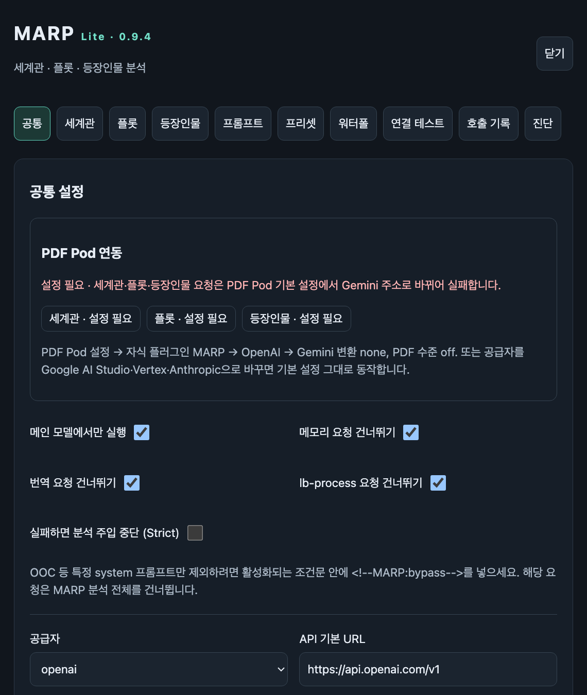

# PDF 설정과 PDF Pod 병용

[처음으로](../README.md) · [진단 화면 사용법](DIAGNOSTICS.md) · [PDF Pod 안에서 쓰기 (화면 안내)](PDF-POD.md)

MARP Lite에서 내장 PDF를 사용한다면 PDF Pod의 해당 자식 플러그인 **PDF 압축 수준**은 **끄기**로 두세요. PDF Pod가 텍스트 복귀 요청까지 다시 압축하지 않도록 보조 요청의 압축 주체를 하나만 선택합니다. Full의 서버 LLM 요청은 PDF Pod를 통과하지 않습니다.

[PDF Pod 소스](https://pkg.panpka.xyz/pdf-pod.js) v0.17.10의 요청 감지·기존 PDF 보호·자식 훅 동작을 기준으로 호환성을 맞췄습니다. 향후 PDF Pod 업데이트에는 변경된 동작을 확인해야 합니다.

**PDF Pod 병용 설정: API 형식 감지 `자동`, API 형식 변환 `끄기`.** 이미 PDF가 포함된 요청을 다시 변환하지 않는 설정입니다. PDF Pod의 메인 대화 압축과 MARP의 보조 분석 압축은 각각 적용 범위가 다릅니다. MARP는 PDF Pod 내부 설정을 변경하지 않습니다.

| 내장 수준 | 동작 |
| --- | --- |
| `off` | 기존 텍스트 요청. 기존 설치의 기본값 |
| `quality` | 변환할 자료 앞부분 약 80%는 PDF, 나머지는 텍스트. 활성화 시 권장 |
| `standard` | system 지침은 텍스트, 대화 자료는 PDF |
| `max` | system도 PDF에 포함하고 외부에는 분석 작업 지시를 남김 |

| 공급자 | PDF 요청 |
| --- | --- |
| OpenAI / Custom | Chat Completions `file` 블록 |
| Google AI Studio | native Gemini `inlineData` PDF |
| Vertex Gemini | 서비스 계정 OAuth 인증 + native Gemini PDF |
| Anthropic | Messages API base64 `document` 블록 |

Google OpenAI 호환 URL과 Vertex `/endpoints/openapi` URL은 내장 PDF 사용 시 native Gemini URL로 변환합니다. 주소를 안전하게 결정할 수 없는 프록시나 변환할 수 없는 추가 JSON은 원래 텍스트 요청을 사용합니다. 텍스트 요청은 기존 공급자 URL을 유지합니다.

280토큰 추정 이하의 짧은 자료는 PDF를 생략합니다. UTF-8 변환 자료 1MiB, 생성 PDF 8MiB를 넘거나 생성에 실패하면 같은 자료를 텍스트로 보냅니다. 명확한 PDF 미지원 400/415/422 응답에만 텍스트로 한 번 재시도하며 인증 오류·429·일반 서버 오류에는 이 재시도를 하지 않습니다. PDF 작업과 복귀 요청도 분석 시간 제한에 포함됩니다.

Lite의 Worker는 작업 후 종료하고 Object URL을 회수합니다. Worker가 차단된 환경에서는 짧은 작업 단위로 나눠 처리합니다. Full은 PDF·프롬프트·LLM 요청을 서버에서 처리합니다.

PDF에는 Unicode 추출용 문자 매핑을 포함해 한글·일본어·이모지·역할·순서·줄바꿈을 보존합니다. 글꼴 파일은 포함하지 않아 시각 렌더링은 뷰어의 대체 글꼴에 의존합니다. 텍스트 추출을 지원하지 않고 렌더링만 사용하는 경로의 품질은 확인되지 않았습니다. **실제 비용 절감과 분석 품질은 모델별로 다릅니다. 진단 탭의 텍스트/PDF 테스트를 직접 실행해 비교하세요.** 평소에는 비교용 LLM 호출이 추가되지 않습니다.

## PDF Pod 안에서 자동 안내 (v0.9.4)

PDF Pod의 **API 형식 변환** 기본값(`자동`)은 OpenAI 형식 요청을 모두 Gemini 주소로 다시 보냅니다. 그래서 OpenAI·OpenRouter·Vercel·로컬 모델처럼 Google이 아닌 주소를 쓰면 API 키가 Google로 전달되어 분석이 실패합니다. 연결 테스트는 모델 목록 조회(GET)라 PDF Pod가 바꾸지 않으므로, 테스트만 성공하고 실제 분석은 실패할 수 있습니다.

MARP Lite는 PDF Pod 안에서 실행되는지 스스로 확인하고 아래처럼 안내합니다. PDF Pod 밖에서는 아무것도 바뀌지 않습니다.

| 에이전트 공급자 | PDF Pod 기본 설정에서 | 카드 표시 |
| --- | --- | --- |
| Anthropic | 변환 없이 그대로 전송 | 변환 없이 전송 |
| Google AI Studio · Vertex (`googleapis.com`) | Gemini로 변환되어 동작 | Gemini 변환 · 동작 |
| 그 외 OpenAI 호환 주소 | Gemini 주소로 바뀌어 실패 | 설정 필요 |

- **공통 탭 · PDF Pod 연동 카드:** 켜진 에이전트마다 위 판정을 보여 주고, 설정 변경이 필요하면 `API 형식 변환 끄기, PDF 압축 수준 끄기`를 안내합니다. 저장된 credential이 하나도 없으면 PDF Pod가 자식 플러그인마다 저장 공간을 나눈다는 점도 알려 줍니다.
- **워터폴 · 호출 기록:** PDF Pod 안에서 분석이 실패하고 설정 필요 에이전트가 있으면 같은 조치를 빨간 글씨로 덧붙입니다.
- **연결 테스트:** 성공해도 설정 필요 에이전트가 있으면 같은 조치를 표시합니다.

설치부터 설정 변경까지 화면 순서대로 보려면 [PDF Pod 안에서 MARP Lite 쓰기](PDF-POD.md)를 참고하세요.

PDF Pod가 자식 훅 예외를 흡수하면 Strict가 메인 호출을 차단한다고 보장할 수 없습니다. UI는 분석 실패와 주입 중단을 구분합니다.

